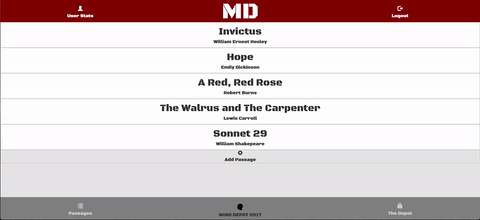
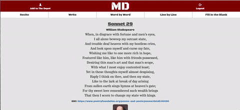
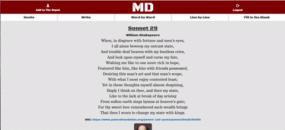
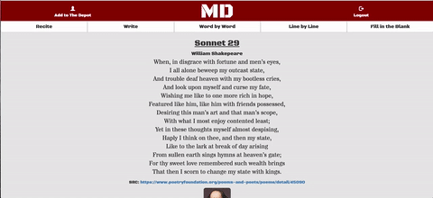

## Mind Depot
Mind Depot is a full-stack web application to catalog text passages and accelerate the process of memorizing them by rote. Mind Depot allows the user to input and save any passage from Shakespeare to a favorite quote or speech.

Mind Depot includes five games to accelerate the memorization process:

* _Recite_ shows user how many times passage has been recited
* _Write_ compares user's text to original text
* _Word by Word_ displays the passage word by word
* _Line by Line_ displays the passage line by line
* _Fill in the Blank_ removes a random word from passage so user can guess it

The Depot stores all the passages that the user memorizes by rote. The user is able to browse through all the passages in The Depot. Mind Depot is intended for mobile use, so the user can practice whenever a cellular device is present.

## Installation
To run Mind Depot locally:

* Ensure that [Node.js](https://nodejs.org/en/) is installed
* Ensure that [MongoDB](https://www.mongodb.com/) is installed
* `npm install` dependencies
* Eagle Reserve requires a MongoDB DBMS, and a database URL at environmental variable `DATABASE_URL`. Mind Depot was developed using [MongoDB](https://www.mongodb.com/) and [Mongoose](http://mongoosejs.com/).

## Demo
<h3 align= "center">Login</h3>

  

<h3 align= "center">Recite</h3>

  

<h3 align= "center">Write</h3>

  

<h3 align= "center">Word By Word</h3>

  

<h3 align= "center">Line By Line</h3>

  

<h3 align= "center">Fill in the Blank</h3>

  

<h3 align= "center">Other Features</h3>

  

## Technologies Used:

  * Node.js
  * Express.js
  * AngularJS
  * MongoDB
  * Mongoose
  * Passport Local
  * Bootstrap
  * CSS3
  * HTML5
  * UI Bootstrap
